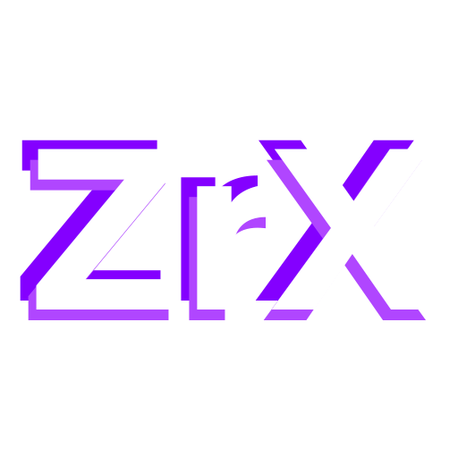
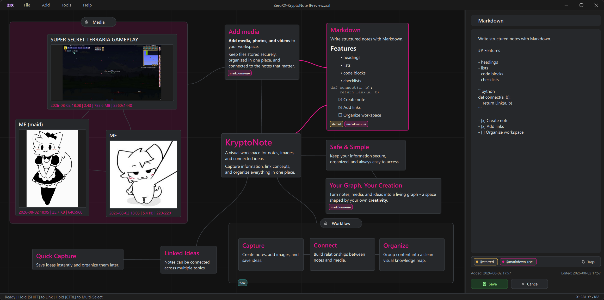

<div align="center">
  
  <h1>ZeroXX-KryptoNote</h1>
  <p><strong>Локальная визуальная база знаний для заметок, изображений, видео, аудио и связей между ними.</strong></p>
  <p>Собирайте идеи на бесконечном холсте, превращайте их в понятный граф и храните содержимое проекта на своём устройстве — без регистрации, подписки и обязательного облака.</p>
  <p>
    
    
    
    <a href="LICENSE"></a>
  </p>
  <p>
    <a href="#быстрый-старт">Быстрый старт</a> ·
    <a href="#возможности">Возможности</a> ·
    <a href="#приватность-и-защита">Приватность</a> ·
    <a href="#экспорт-и-переносимость">Экспорт</a>
  </p>
</div>

> **Один проект — один `.zrx` файл.** Его можно перенести на другой диск, положить в архив или сохранить в резервную копию без привязки к аккаунту и серверу.



## Не ещё один список заметок

Обычный блокнот заставляет раскладывать информацию по папкам и страницам. ZeroXX-KryptoNote даёт свободный холст: заметка, изображение, видео или группа становятся узлами, а смысловая связь между ними — видимой линией.

Так проще держать перед глазами не только отдельные факты, но и контекст: что к чему относится, откуда появилась идея и какие материалы нужны дальше.

ZeroXX-KryptoNote подойдёт для:

- личной базы знаний и цифрового архива;
- планирования проектов и сюжетов;
- учёбы, исследований и разбора сложных тем;
- moodboard, референсов и медиаколлекций;
- схем, расследований и карт взаимосвязей;
- приватных материалов, которые не хочется загружать в сторонний сервис.

## Возможности

| Возможность | Что это даёт |
| --- | --- |
| **Бесконечный холст** | Свободное размещение, масштабирование и навигация без жёсткой структуры страниц. |
| **Markdown-заметки** | Заголовки, списки, чек-листы, блоки кода и читаемый предпросмотр прямо в узле. |
| **Изображения, видео и аудио** | Медиа хранится рядом с контекстом, отображается на холсте и открывается во встроенном просмотрщике. Audio-ноды показывают waveform и управляемое воспроизведение. |
| **Markdown-описания медиа** | Image/video/audio-ноды поддерживают то же Markdown-описание, что и текстовые узлы. В просмотрщике есть раздельная область медиа и редактора с Save/Cancel, `Ctrl+S` и защитой несохранённых изменений. |
| **Связи между узлами** | Идеи объединяются в граф, который показывает структуру темы или проекта. |
| **Фреймы** | Узлы можно собирать в визуальные группы, настраивать их цвет и прозрачность, блокировать и перемещать вместе. |
| **Теги** | Цветные метки помогают классифицировать материалы без дублирования по папкам. |
| **Поиск** | Быстрый переход к нужному содержимому на большой карте знаний. |
| **Множественный выбор** | Удобная работа сразу с группой узлов: выделение рамкой, перенос и удаление. |
| **Настройка интерфейса** | Светлые и тёмные тона, свой акцент, интенсивность сетки и внешний вид связей. |
| **Статистика проекта** | Отдельная панель показывает объём базы, количество узлов и связей. |
| **Экспорт и backup** | Проект можно представить в HTML или Markdown, упаковать в ZIP и сохранить резервную копию. |

## Как выглядит рабочий процесс

1. **Соберите материал.** Создайте текстовую заметку или перетащите в проект изображения, видео и аудио.
2. **Добавьте контекст.** Подпишите узлы, используйте Markdown и назначьте цветные теги.
3. **Свяжите идеи.** Соедините связанные узлы и сгруппируйте их во фреймы.
4. **Вернитесь к нужному за секунды.** Используйте поиск, навигацию и масштабирование холста.
5. **Передайте результат.** Экспортируйте интерактивный HTML, Markdown или полный архив проекта.

## Почему локальный подход важен

- **Без аккаунта.** Для начала работы не нужны электронная почта и регистрация.
- **Без обязательного облака.** Приложение не зависит от доступности внешнего сервиса.
- **Контроль над файлами.** Пользователь сам выбирает, где лежат проекты и их резервные копии.
- **Переносимый формат.** Независимые `.zrx`-проекты легко разделять, архивировать и копировать.
- **Текст и медиа в одном месте.** Не нужно поддерживать отдельную папку с вложениями и бояться сломанных ссылок.

## Приватность и защита

Содержимое проекта хранится локально в SQLite-контейнере `.zrx`. Приложение не требует подключения к сети для обычной работы с базой.

- **AES-256-GCM** шифрует названия, текст, имена тегов, миниатюры, исходные имена файлов и медиаданные.
- **Argon2id** получает ключ из пароля и усложняет перебор паролей.
- Для каждого проекта создаётся отдельный случайный ключ данных.
- Контекстная аутентификация зашифрованных полей помогает обнаруживать подмену или повреждение содержимого.
- Крупные медиафайлы шифруются и хранятся чанками, поэтому их не нужно целиком держать в памяти.
- Видео расшифровывается потоком в память и не выгружается во временный открытый файл на диск.
- Audio-ноды используют MP3, WAV, FLAC, OGG/Vorbis, Opus, M4A/AAC и дополнительные форматы, которые сообщает установленный Qt Multimedia backend; оригинальные байты хранятся чанками.
- Перед миграцией старого формата и при смене пароля можно создать резервную копию.

> [!IMPORTANT]
> Пароль проекта не восстанавливается. Храните его в надёжном менеджере паролей и регулярно делайте backup `.zrx`-файла.

<details>
<summary><strong>Границы модели защиты</strong></summary>

KryptoNote шифрует пользовательское содержимое проекта. Служебная структура, необходимая для построения холста — например типы, координаты, размеры узлов и их связи — хранится отдельно от зашифрованных полей. Для сокрытия самого факта наличия базы и её служебной структуры используйте шифрование диска или отдельного контейнера.

Проект не заявлен как прошедший независимый аудит безопасности. Для критически важных секретов не полагайтесь только на одно приложение или один носитель.

</details>

## Экспорт и переносимость

| Формат | Назначение |
| --- | --- |
| **`.zrx`** | Рабочий файл KryptoNote: структура графа и зашифрованное содержимое проекта. |
| **`.zip`** | Полный архив с графом, данными и оригинальными медиа; архив можно дополнительно защитить AES-256. |
| **`.html`** | Один интерактивный офлайн-файл с графом, поиском и встроенными медиа для просмотра в браузере. |
| **`.md`** | Текстовые заметки, Markdown-описания медиа и метаданные вложений — удобно для Git, документации и других Markdown-редакторов. |

Можно экспортировать весь проект или только выбранные узлы. Обычный экспорт содержит расшифрованные данные; для передачи чувствительных материалов используйте защищённый ZIP и передавайте пароль отдельно.

## Быстрый старт

### Требования

- [uv](https://docs.astral.sh/uv/getting-started/installation/) для установки Python, зависимостей и запуска проекта;
- Git — только если репозиторий клонируется командой ниже.

KryptoNote написан на Python и PySide6 и не привязан к одной операционной системе. Основная разработка и проверка сейчас ведутся на Windows, но приложение должно запускаться также на Linux и macOS. На Linux возможны отдельные проблемы с системными кодеками, мультимедиа или интеграцией оконного менеджера — сообщения о таких случаях приветствуются.

### Запуск из исходников

```shell
git clone https://github.com/0xPROSTO/KryptoNote.git
cd KryptoNote

uv sync
uv run main.py
```

`uv sync` создаст локальное окружение `.venv`, подберёт совместимый Python версии 3.11 или новее и установит точные версии пакетов из `uv.lock`.

При первом запуске:

1. Введите имя нового проекта и нажмите **Create**.
2. Задайте пароль и сохраните его в надёжном месте.
3. Добавьте первую заметку через **Add → Note** или `Ctrl+N`.

Проекты по умолчанию создаются в папке `cases`, но в лаунчере можно подключить другие каталоги.

## Основные сочетания клавиш

| Действие | Сочетание |
| --- | --- |
| Создать заметку | `Ctrl+N` |
| Добавить изображения | `Ctrl+M` |
| Добавить видео | `Ctrl+Shift+M` |
| Открыть поиск | `Ctrl+F` |
| Сохранить | `Ctrl+S` |
| Выбрать все узлы | `Ctrl+A` |
| Включить привязку к сетке | `G` |
| Перемещать холст | `MMB` + перетаскивание |
| Масштабировать вокруг курсора | `Ctrl` + колёсико мыши |
| Создать связь | удерживать `Shift` и нажать по двум узлам |
| Выделить область | `Ctrl` + перетаскивание по пустому холсту |

Полный список доступен внутри приложения: **Help → Show All Keybinds**.

## Технологии

- **Python** — прикладная логика и сервисы;
- **PySide6 / Qt Quick / QML** — интерфейс и отрисовка холста;
- **SQLite** — переносимый файл проекта;
- **cryptography** — AES-256-GCM и Argon2id;
- **OpenCV + Pillow** — обработка медиа и миниатюр.
- **uv** — воспроизводимое окружение и единый lock-файл для разных платформ.


## Участие в разработке

Сообщения об ошибках, идеи и pull request приветствуются. Перед отправкой изменений проверьте, что приложение запускается, а существующие `.zrx`-проекты открываются без потери данных.

## Лицензия

ZeroXX-KryptoNote распространяется по лицензии [MIT](LICENSE).
